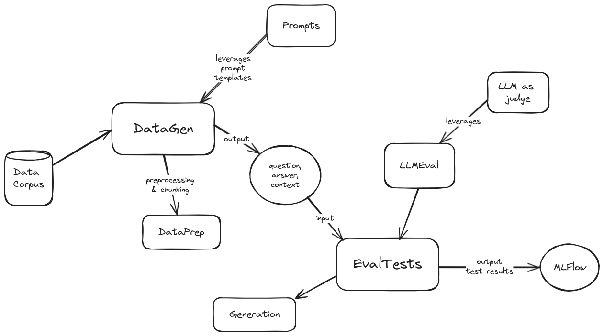

# qEvals

## Table of Contents
- [What is evals?](#what-is-evals)
- [Getting Started](#getting-started)
- [Prerequisites](#prerequisites)
- [Compatibility](#compatibility)
- [Running Tests](#running-tests)
- [Contributing](#contributing)
- [Release Notes](./docs/release_notes/)

<br/>

## What is evals? <a name="what-is-evals"></a>

Evals is a synthetic data generation and evaluation framework for LLMs and RAG applications.

It has 2 main modules:
- datagen
- eval

A high level architecture diagram of evals is the following:

Architecture diagram

<span style="text-align: center; width: 100%;">
    
</span>

## Getting Started <a name="getting-started"></a>

To get started with evals, follow these steps:

1. Clone the repository to your local machine.
2. Install the necessary dependencies by running `pip install -r requirements.txt` in the project directory.
3. Create a copy of `config/config_template.yaml` and name it `config/config.yaml`.
4. Update 2 sections in the `config.yaml` file:
    1. `SSL`
        - Configure your SSL cert file location.
    2. `AGG`
        - Set `DATA_DIR` variable controls the location of the data corpus to generate synthetic data from, it’s relative to the `datagen/data/` directory. In other words, add your data directories in there and specify their name in the variable.
        - The `LANG_PROVIDER` variable allows choosing between `azuma`, `vertex` and `staller`.
        - Each of the rest variables are for model design and are documented.
    3. `TESTS`
        - `EVAL_TESTS` offers a list of evaluation tests supported by the framework. The possible options are `AnswerRelevancy`, `Hallucination`, `Faithfulness`, `Bias`, `Toxicity`, `Correctness`, `Coherence`, `PromptInjection`, `PromptBreaking`, `PromptLeakage`.
        - The `PROMPTS` variable allows choosing the prompt sets to be used as judge for the evaluations.

5. Run the command: `python src/datagen/client.py`.
    - This will generate synthetic data in the `datagen/qa_out/` directory as a CSV file with the format:

        ```csv
        question,context,ground_truth
        ```

    - The synthetically generated data will be stored in the `datagen/qa_out/` directory.

6. Execute the eval command:
    ```shell
    python src/eval.py --input_csv ./datagen/qa_out/generated_data.csv
    ```
    - This will generate evaluations for the questions generated in the synthetic data generation (e.g. answers in `question`, `context`, `ground_truth` with a record per chunk created from the data corpus).

    - If the `answer` column is not provided in the input CSV, the tool will ignore the `test_data` column and generate new outputs using the configured generative model.

7. Run the following command to see results on your local MLFLOW interface:
    ```shell
    mlflow ui --backend-store-uri sqlite:///mlflow.db
    ```
    - You can view the evaluation results in your local MLFLOW interface here: [http://localhost:5000](http://localhost:5000)
